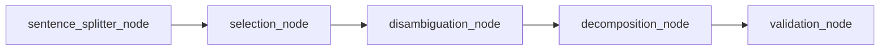
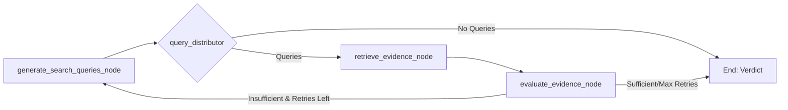
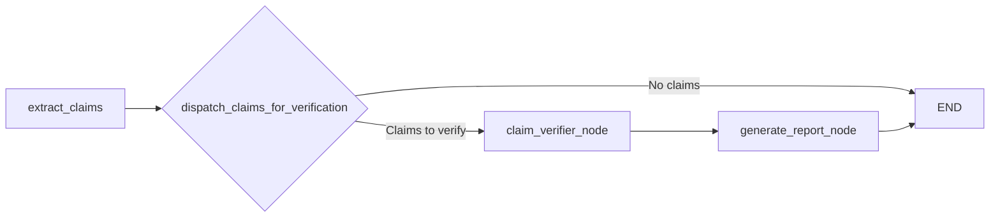

# Fact Checker Core Module 🔍⚙️

This directory contains the implementation of the fact-checking system's core functionality. While the [main README](../../README.md) provides a high-level overview and usage examples, this document focuses on the technical architecture and how the agent workflows are implemented.


## 🏗️ Technical Architecture

The FACT AI is designed as a multi-agent system (MAS) using LangGraph to orchestrate complex workflows. The system is split into three main modules, each with its own specific responsibility:

```
agent/
├── claim_extractor/   # Extracts factual claims from text
├── claim_verifier/    # Verifies claims against evidence
└── fact_checker/      # Orchestrates the entire workflow
```

## 🤖 Agent Workflows

Each module is implemented as a standalone LangGraph agent with its own workflow:

### Claim Extractor Workflow

The claim extractor implements the Claimify methodology with a 5-stage pipeline:



- **Sentence Splitter**: Breaks text into contextual sentences
- **Selection**: Filters for sentences with factual content
- **Disambiguation**: Resolves ambiguities like pronouns
- **Decomposition**: Extracts specific atomic claims
- **Validation**: Ensures claims are properly formed

### Claim Verifier Workflow

The claim verifier implements an evidence-based verification process:



- **Query Generation**: Creates search queries for the claim
- **Evidence Retrieval**: Gathers evidence from web search
- **Evidence Evaluation**: Assesses if evidence supports/refutes the claim

### Fact Checker Orchestrator

The main orchestrator ties everything together:



- **Extract Claims**: Calls the claim extractor subsystem
- **Dispatch Claims**: Fans out for parallel verification
- **Claim Verifier**: Verifies each claim independently
- **Generate Report**: Compiles final fact-check report

## 🔄 Inter-agent Communication

The agents communicate through well-defined interfaces:

1. The orchestrator calls the claim extractor with the input text
2. The extractor returns validated claims
3. The orchestrator dispatches each claim to the verifier
4. The verifier returns verdicts for each claim
5. The orchestrator compiles everything into a final report

## 📦 Module Structure

Each module follows a similar structure:

```
module/
├── __init__.py       # Exports key components
├── agent.py          # LangGraph workflow definition
├── config/           # Configuration settings
├── llm/              # LLM utilities
├── nodes/            # Core node implementations
└── schemas.py        # Data models
```

## 🛠️ Implementation Details

- All modules use LangGraph's StateGraph for workflow management
- Parallel processing is implemented via LangGraph's Send mechanism
- Each node is implemented as an async function to allow for concurrent operations
- Configuration settings can be adjusted through the config/ directory in each module

## 🔬 Development

### Setup

First, initialize the database:

```bash
poetry run python -m scripts.init_db
```

### Development and Testing

For development and testing:

1. Start with small test cases that generate 1-2 claims
2. Use the `astream_events` method to observe the workflow step by step
3. Configure LLM parameters (temperature, etc.) in the respective config files

For more specific implementation details of each module, check their respective README files:
- [Claim Extractor README](./claim_extractor/README.md)
- [Claim Verifier README](./claim_verifier/README.md)
- [Fact Checker README](./fact_checker/README.md)
