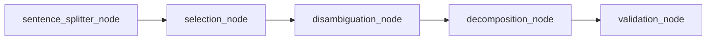

# Claim Extractor 🔎

This is my implementation of the Claim Extractor - the first critical piece of our fact-checking pipeline. It's based on the Claimify methodology and honestly, getting this part right was half the battle. The whole idea is to take text and pull out clear, verifiable claims that we can actually check for accuracy.

## 📋 What's this all about?


I've implemented the approach from Metropolitansky & Larson's 2025 paper ["Towards Effective Extraction and Evaluation of Factual Claims"](https://arxiv.org/abs/2502.10855). Their Claimify method is pretty clever - it breaks down the process into stages that tackle different challenges:

1.  **Sentence Splitting**: First, we chop up the text into sentences (with context from surrounding sentences)
2.  **Selection**: Then we figure out which sentences actually contain facts we can verify (vs opinions or fluff)
3.  **Disambiguation**: This was the trickiest part - resolving pronouns and unclear references
4.  **Decomposition**: Breaking complex sentences into simpler, atomic claims
5.  **Validation**: Double-checking that each claim stands on its own as a proper sentence

## 📝 How to use it

While this is typically used as the first step in the full ClaimeAI pipeline, you can also use it standalone like this:

```python
import asyncio
from claim_extractor import graph

async def check_those_facts():
    result = await graph.ainvoke(
        {
            "answer_text": "The primary drivers of climate change include greenhouse gas emissions from burning fossil fuels, deforestation, and industrial processes. The IPCC report indicates that human activities have caused approximately 1.0°C of global warming above pre-industrial levels.",
        }
    )

    # Check out what we extracted!
    for claim in result["validated_claims"]:
        print(f"✓ {claim.claim_text}")


# You'll get output like:
# ✓ Greenhouse gas emissions from burning fossil fuels are a primary driver of climate change
# ✓ Deforestation is a primary driver of climate change
# ✓ Industrial processes are a primary driver of climate change
# ✓ The Intergovernmental Panel on Climate Change report indicates that human activities have caused approximately 1.0°C of global warming above pre-industrial levels

# Let's run it!
if __name__ == "__main__":
    asyncio.run(check_those_facts())
```

Pretty neat, right? It takes those complex sentences and breaks them down into specific testable claims. I've noticed the quality of these extracted claims makes a huge difference in the final fact-checking accuracy.

## 📊 How the pipeline works

The workflow is built using LangGraph, which made it much easier to handle the sequential processing with state management:



Each node does something specific:

-   **`sentence_splitter_node`**: Splits the text and adds contextual info. I found that keeping 5 preceding sentences gives enough context for most cases.
-   **`selection_node`**: Filters for sentences with actual facts (this saves a ton of processing time and reduces false positives). Following the paper, it identifies sentences that contain "specific and verifiable propositions" while filtering out pure opinions, interpretations, and generic statements.
-   **`disambiguation_node`**: Resolves those pesky pronouns and references. This is where multiple LLM calls with voting helps resolve ambiguities. What's unique about Claimify is that it can identify when a sentence has *unresolvable* ambiguity and exclude it from further processing - something that most extraction methods don't handle well.
-   **`decomposition_node`**: Breaks down complex sentences into atomic claims. The paper defines these as "the simplest possible discrete units of information" that can be independently verified.
-   **`validation_node`**: Sanity checks that each claim is a proper standalone sentence that can be verified.

## 🔍 A Deeper Look at Disambiguation

The disambiguation stage in Claimify is particularly interesting. According to the paper, it addresses two key types of ambiguity:

1. **Referential ambiguity**: This happens when it's unclear what a word or phrase refers to. For example, in "They will update the policy next year," the terms "They," "the policy," and "next year" are all ambiguous without proper context.

2. **Structural ambiguity**: This occurs when the grammatical structure allows for multiple interpretations. For instance, "AI has advanced renewable energy and sustainable agriculture at Company A and Company B" could mean either:
   - AI has advanced both renewable energy and sustainable agriculture at both companies, or
   - AI has advanced renewable energy at Company A and sustainable agriculture at Company B

What's clever about Claimify's approach is that it only moves forward with claims when there's high confidence in the correct interpretation. In cases where the context doesn't provide enough information to resolve ambiguity, the sentence is labeled "Cannot be disambiguated" and excluded from further processing, even if it contains other unambiguous, verifiable components. This quality-over-quantity approach leads to more accurate fact-checking.

## ⚙️ Customizing things

If you want to tweak how it works (and you probably will for your specific use case), check out the settings in:

-   `config/nodes.py`: Here you can adjust things like how many LLM completions to use for voting and minimum success thresholds.
-   `llm/config.py`: Change which model you're using or adjust temperature settings (I've found lower temps work better for this task).

For example, if you're getting too many false negatives in the selection stage, try increasing the temperature a bit to get more diverse judgments.

## 🔬 The cool parts

There are a few things that make this implementation work particularly well:

-   **Multi-stage Processing**: Breaking down the complex problem of claim extraction into manageable, specialized steps.
-   **Disambiguation Handling**: This was a game-changer. So many claim extraction tools fall apart with pronouns and ambiguity, but Claimify's approach to identifying and handling both referential and structural ambiguity gives it an edge.
-   **Voting Mechanism**: Using multiple LLM completions with voting for critical stages like selection and disambiguation to improve reliability and consistency.
-   **Precision-First Approach**: Following the research paper's philosophy, this implementation prioritizes extracting claims only when there's high confidence in the correct interpretation - better to miss some claims than to extract inaccurate ones.
-   **Built on LangGraph**: Made the pipeline much easier to visualize, debug, and extend.

## 📂 How it's organized

Here's how the code is structured (in case you want to dive in):

```
claim_extractor/
├── __init__.py            # Exports key components
├── agent.py               # The LangGraph workflow definition
├── config/                # Configuration settings
│   ├── __init__.py
│   ├── nodes.py           # Settings for each pipeline stage
│   └── llm.py             # Old LLM settings (now in llm/config.py)
├── llm/                   # LLM utilities 
│   ├── __init__.py
│   ├── config.py          # Model name and temperature settings
│   └── models.py          # Functions to get LLM instances
├── nodes/                 # The core logic for each stage
│   ├── __init__.py
│   ├── sentence_splitter.py
│   ├── selection.py
│   ├── disambiguation.py
│   ├── decomposition.py
│   └── validation.py
├── prompts.py             # All the prompts for LLM interactions
└── schemas.py             # Data models used throughout the pipeline
```

The most interesting files to look at are probably in the `nodes/` directory if you want to understand how each stage works.

## 📚 The research behind it

This implementation is based on the **Claimify** methodology, which according to the paper evaluates claim extraction on three main criteria:

1.  **Entailment**: Claims must logically follow from the source text - if the source text is true, the extracted claims must also be true.

2.  **Coverage**: The process should capture all verifiable information while skipping non-factual content. The paper proposes both sentence-level coverage (correctly identifying sentences with factual claims) and element-level coverage (capturing the individual factual elements within those sentences).

3.  **Decontextualization**: Extracted claims should be understandable on their own without requiring additional context, while retaining the meaning they held in their original context. The paper proposed a novel evaluation method that focuses on whether omitted context would change a fact-checking verdict.

What I really like about Metropolitansky & Larson's approach is how it handles ambiguity - it only extracts claims when it has high confidence in the correct interpretation. They demonstrated that Claimify outperforms existing methods on all three criteria (entailment, coverage, and decontextualization), especially due to its careful handling of ambiguity and its precision-first approach.

## 🙏 Acknowledgments

Major props to:

-   Metropolitansky & Larson at Microsoft Research - their Claimify methodology is super solid
-   The LangChain team - LangGraph saved me weeks of development time
-   OpenAI - the backbone LLMs that power all of this

## 💬 Citation

If you use this implementation in your work, please cite the original paper:

```bibtex
@misc{metropolitansky2025towards,
  author = {Metropolitansky, Dasha and Larson, Jonathan},
  title = {Towards Effective Extraction and Evaluation of Factual Claims},
  year = {2025},
  month = {February},
  abstract = {A common strategy for fact-checking long-form content generated by Large Language Models (LLMs) is extracting simple claims that can be verified independently. Since inaccurate or incomplete claims compromise fact-checking results, ensuring claim quality is critical. However, the lack of a standardized evaluation framework impedes assessment and comparison of claim extraction methods. To address this gap, we propose a framework for evaluating claim extraction in the context of fact-checking along with automated, scalable, and replicable methods for applying this framework, including novel approaches for measuring coverage and decontextualization. We also introduce Claimify, an LLM-based claim extraction method, and demonstrate that it outperforms existing methods under our evaluation framework. A key feature of Claimify is its ability to handle ambiguity and extract claims only when there is high confidence in the correct interpretation of the source text.},
  url = {https://www.microsoft.com/en-us/research/publication/towards-effective-extraction-and-evaluation-of-factual-claims/},
}
```

Check out the full paper here: [Towards Effective Extraction and Evaluation of Factual Claims](https://www.microsoft.com/en-us/research/publication/towards-effective-extraction-and-evaluation-of-factual-claims/) 
