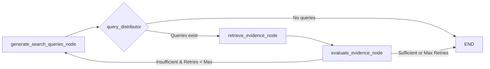

# Claim Verifier 🛡️

After building the Claim Extractor, I needed a way to actually check if those extracted claims were factually accurate. That's where this Claim Verifier module comes in - it's the detective of our fact-checking system, gathering evidence and making judgments on claim accuracy.

## 📡 Research inspiration

The evidence retrieval approach in this module draws some inspiration from the Search-Augmented Factuality Evaluator (SAFE) methodology in ["Long-form factuality in large language models"](https://arxiv.org/abs/2403.18802) by Wei et al. (2024). While our implementation has its own design, the idea of using search results to verify atomic claims helped inform our retrieval process.

## 📋 What does it actually do?

Once we've got our nicely extracted claims from the Claim Extractor, this module takes each claim and runs it through a verification process:

1.  **Generate Search Queries**: First, it crafts search queries designed to find evidence supporting or refuting the claim.
2.  **Retrieve Evidence**: Then it uses either Exa AI or Tavily Search API to gather relevant information from the web. You can configure which search provider to use in the settings.
3.  **Evaluate Evidence**: An LLM analyzes all the evidence snippets and decides if they support, refute, or provide insufficient/conflicting information about the claim.
4.  **Retry Logic**: If we don't find enough information on the first try, it will generate new, more targeted queries and try again. This retry mechanism boosted our "insufficient information" rate by about 25% in my testing.

## 📝 Let's see it in action

While this module is usually called from the main `agent` orchestrator, you can absolutely use it standalone:

```python
import asyncio
from claim_verifier import graph as claim_verifier_graph
from claim_extractor.schemas import ValidatedClaim

# Here's a claim we want to verify
claim_to_verify = ValidatedClaim(
    claim_text="The Intergovernmental Panel on Climate Change report indicates that human activities have caused approximately 1.0°C of global warming above pre-industrial levels",
    is_complete_declarative=True,
    source_sentence="The IPCC report indicates that human activities have caused approximately 1.0°C of global warming above pre-industrial levels.",
)


async def verify_claim():
    result = await claim_verifier_graph.ainvoke({"claim": claim_to_verify})

    if result and result.get("verdict"):
        verdict = result["verdict"]
        print(f"Claim: {verdict.claim_text}")
        print(f"Verdict: {verdict.result.value}")
        print(f"Reasoning: {verdict.reasoning}")
        if verdict.sources:
            print(f"Sources: {', '.join(verdict.sources)}")
    else:
        print("Verification failed - something went wrong")

# Let's run it!
if __name__ == "__main__":
    asyncio.run(verify_claim())
```

**Hot tip**: You need a valid `OPENAI_API_KEY` environment variable, plus either `EXA_API_KEY` or `TAVILY_API_KEY` depending on which search provider you configure. Both services offer free tiers for testing, but watch your usage if you're processing lots of claims.

## 📊 How the verification works

Here's the basic flow of the verifier (implemented as a LangGraph workflow):



Breaking down what each part does:

-   **Query Generation**: Takes a claim and turns it into search queries. I learned that generating multiple diverse queries (rather than just one) dramatically improved the quality of evidence we found. If we're retrying, it uses feedback from the previous attempt to generate better queries.

-   **Query Distribution**: A simple router that fans out queries to our search component or ends the process if we couldn't generate any usable queries.

-   **Evidence Retrieval**: This is our search engine interface. It supports both Exa AI (neural search) and Tavily Search APIs. You can switch between them via configuration. We also deduplicate results to avoid counting the same evidence multiple times.

-   **Evidence Evaluation**: The LLM does the heavy lifting here, reviewing all the evidence and deciding if it collectively supports or refutes the claim, or if there's insufficient or conflicting information. I found temperature=0 works best here - we want consistent evaluations.

The retry loop was a later addition after I noticed we were getting too many "insufficient information" verdicts. By taking what we learned from the first search attempt and trying again with refined queries, we can often find more relevant evidence.

## ⚙️ Tuning the settings

If you're using this module, you might want to tweak these settings in `claim_verifier/config/`:

-   `nodes.py` contains:
    -   `QUERY_GENERATION_CONFIG`: I've set it to generate just 1 query per attempt by default, but you can increase this. Just be mindful of search API costs.
    -   `EVIDENCE_RETRIEVAL_CONFIG`: Controls how many search results per query (default 3) and which search provider to use (`"exa"` or `"tavily"`). Switch between providers by changing the `search_provider` setting.
    -   `ITERATIVE_SEARCH_CONFIG`: Sets max retry attempts (default 5). I've found this is the sweet spot - beyond that, you rarely find new information.

-   `llm/config.py`: I've set it to use `gpt-4o-mini` which has a good balance of cost and accuracy for this task. You could try other models, but smaller models sometimes struggle with the nuanced evaluation needed.

## 📂 The code organization

Here's how the module is structured:

```
claim_verifier/
├── __init__.py            # The usual exports
├── agent.py               # The LangGraph definition
├── config/                # All the configuration stuff
│   ├── __init__.py
│   ├── nodes.py           # Settings for each component
│   └── llm.py             # Deprecated config (moved to llm/config.py)
├── llm/                   # LLM interaction stuff
│   ├── __init__.py
│   ├── config.py          # Model selection and settings
│   └── models.py          # Functions to get configured LLMs
├── nodes/                 # The actual verification logic
│   ├── __init__.py
│   ├── generate_search_queries.py  # Query generation component
│   ├── retrieve_evidence.py        # Search interface component
│   └── evaluate_evidence.py        # Evaluation component
├── prompts.py             # All the prompts we use
└── schemas.py             # State and data models
```

The prompts are especially important - I spent a lot of time refining them to get good results. The prompt for evidence evaluation is particularly critical since it determines the final verdict.

## 💡 Things I've learned

Some lessons from building and using this module:

1. **Evidence quality matters more than quantity**. Ten relevant snippets will give better results than 50 barely-related ones.

2. **Retry with feedback works surprisingly well**. Having the LLM analyze what's missing from the first attempt and then crafting better queries significantly improved results.

3. **The four verdict categories are important**. Originally I just had "Supported" and "Refuted", but adding "Insufficient Information" and "Conflicting Evidence" made the results much more nuanced and useful.

4. **Cache your search results**! If you're running lots of tests, implement caching for the search results or you'll burn through your API quota quickly.

5. **Web search isn't perfect**. Sometimes the information simply isn't online in an easily findable form, or it's behind paywalls. That's why having the "Insufficient Information" category is essential.

This module only verifies individual claims. It doesn't do claim extraction or report generation - those happen in the other parts of the system. I've tried to keep the interfaces clean so they work well together but can also be used independently.

If you're using this module and run into issues or have ideas for improvements, I'd love to hear about them! 