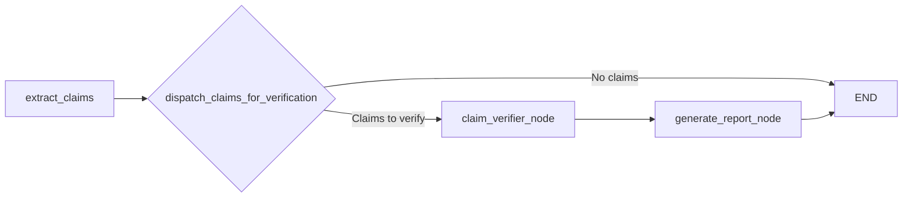

# Agent 🚦

This is the orchestrator - the conductor that makes all the separate pieces of our fact-checking system play together nicely. Building this part was actually the final piece of the puzzle for me, bringing together the claim extraction and verification components into a cohesive, end-to-end pipeline.

## 📋 So what does this thing actually do?

The job of this module is pretty straightforward (at least conceptually): 

1.  **Extract claims**: First, it calls the `claim_extractor` to break down the input text into individual factual claims. This is where all that Claimify magic happens - disambiguating pronouns, splitting complex statements, etc.
2.  **Verify each claim**: Then it hands off each extracted claim to the `claim_verifier` for checking. I built it to process multiple claims in parallel because waiting for them sequentially was painfully slow!
3.  **Compile the results**: Finally, it gathers all the verification results and creates a nicely structured report summarizing what was found.

Think of it as the manager that coordinates the specialist teams. It doesn't do the detailed work itself, but makes sure everything flows properly from start to finish.

## 🚀 How to use it

Ready to fact-check something? Here's the quickest way to get started:

```bash
# Make sure you're in the project root directory
poetry install

# Don't forget your API keys in .env!
# OPENAI_API_KEY=your_key_here
# TAVILY_API_KEY=your_key_here
```

And then in your code:

```python
import asyncio
from fact_checker import graph as fact_checker_graph

async def check_those_facts():
    # This is where you put the text you want to check
    input_data = {
        "question": "What are the primary causes of global warming and what does the IPCC state about human contribution?",
        "answer": "The main drivers of recent global warming are greenhouse gas emissions from burning fossil fuels, deforestation, and industrial activities. The IPCC has stated that human activities have warmed the planet by about 1.0°C since pre-industrial times.",
    }

    # This will store our final report when it's ready
    final_report = None

    # The graph.astream gives you a play-by-play of what's happening
    # You could use graph.ainvoke() instead if you just want the final result
    async for event in fact_checker_graph.astream(input_data):
        for key, value in event.items():
            # I usually print this to see progress in real-time
            print(f"Node: {key} completed!")
            if key == "generate_report_node":  # Last step
                final_report = value.get("final_report")

    # Let's see what we found!
    if final_report:
        print("\n=== THE FACT-CHECK RESULTS ===")
        print(f"Question: {final_report.question}")
        print(f"Answer: {final_report.answer}")
        print(f"Summary: {final_report.summary}")
        print(f"Timestamp: {final_report.timestamp}")
        print("\nVerified Claims:")
        for verdict in final_report.verified_claims:
            print(f"  Claim: {verdict.claim_text}")
            print(f"    Verdict: {verdict.result.value}")
            print(f"    Reasoning: {verdict.reasoning}")
            if verdict.sources:
                print(f"    Sources: {', '.join(verdict.sources)}")
            print("  ---")
    else:
        print("Hmm, something went sideways. No report was generated.")

# Let's run it!
if __name__ == "__main__":
    asyncio.run(check_those_facts())
```

Pro tip: The first run will be pretty slow - you're making a bunch of LLM calls and search API requests. For testing during development, I'd recommend starting with short texts that will generate just 1-2 claims.

## 📊 The "orchestration" magic

This is how the orchestrator ties everything together using LangGraph:



Let me walk through what each part does:

-   **`extract_claims`**: This calls the `claim_extractor` graph to do its thing. Originally I was recreating the extraction logic here, but that got messy fast. Much cleaner to just call the existing graph!

-   **`dispatch_claims_for_verification`**: This is a clever bit that fans out the verification process. It looks at all the claims that came back from the extractor and creates a parallel task for each one. 

-   **`claim_verifier_node`**: For each claim, this node calls the `claim_verifier` graph to search for evidence and evaluate it. The nice thing about LangGraph is that it handles all these parallel executions for me.

-   **`generate_report_node`**: Once all the verification tasks complete, this gathers up the results and creates the final report. This was actually the simplest part to build.


## 📂 What's in the box

If you want to peek inside the orchestrator module:

```
fact_checker/
├── __init__.py            # Usual exports
├── agent.py               # The LangGraph workflow definition
├── nodes/                 # The orchestration components
│   ├── __init__.py
│   ├── extract_claims.py    # Calls the claim_extractor
│   ├── dispatch_claims.py   # Handles the parallel processing
│   ├── claim_verifier.py    # Interfaces with the claim_verifier
│   └── generate_report.py   # Creates the final report
└── schemas.py             # Data models for the state and report
```

The code is pretty clean and focused because most of the heavy lifting happens in the other modules. This module is really about the workflow and connecting the parts together effectively.

## 📝 Lessons learned

The agent module is the entry point most people will use, but remember it's just the coordinator - the specialized modules are where the real algorithms live. If you want to understand how the extraction or verification works, check out those modules' READMEs.

If anything isn't working as expected, let me know! I've tried to make it robust, but there's always room for improvement.

Happy fact-checking!
